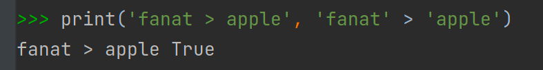

    Типы данных Переменные: Задание 8 50 баллов
Определите, наибольшую с точки зрения Python строку среди fanat, apple, abracadabra, Tarantino, yahoo, yandex, gool, logo?
В решении не должно быть более 7 строк кода.

Использовать можно только функцию print() и операторы сравнения.
Сравните слова следующим образом: первое со вторым, «победителя» этой пары с третьим и так далее. В итоге на последней операции у вас получится самое большое слово.

Строка первого сравнения:

Объясните своими словами получившийся результат.