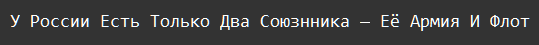

    Типы данных int, str: Задание 6 30 баллов
Приведите строку

sent = "---у_РОССИИ_естЬ_тОЛЬко_дВа_союзнника_—_ЕЁ_АРМИЯ_и_фЛОт==="

к следующему виду

одной строкой кода. Метод замены можно использовать только один раз.