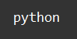

    Типы данных - list: Задание 7 120 баллов
Дан список:

slice_string = ['pgekjsgqlafrimzixwuiavukxdqifadmbdqvszcqizimkifcajycqijwuwwawmbbiiigevfrualbsgijbvskfskwczlbervxkmsgtxrfxswmxsibffvaqrabgwxwcqzcrjiedsizjauufrfdiguzjxhcwlgjiduemddufkewasjfgavsrujgbisagzswdaeebwerdcluoqvgajabbelaadswzdebwgxvdfaugqjazlwvzejdgleszsrlqxnsrkbkqcvgwekwsqezll']

Получите строку 'python' одной строкой кода:

Необходимые символы присутствуют в единичном экземпляре.