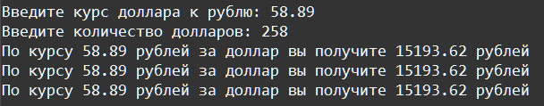

    Форматирование: Задание 2 35 баллов
Напишите программу обмена валют, на вход в которую подаются 2 числа с плавающей точкой. Сделайте вывод в трёх вариантах форматирования, с ограничением 2 знака после точки:

