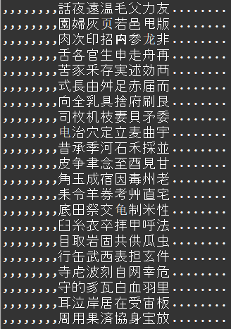

    Форматирование: Задание 3 50 баллов
Выведите в консоль из файла symbol.txt иероглифы по 8 штук в ряд, и, используя форматирование, добавьте в выводе по 8 запятых слева и по 8 точек справа. Подумайте, как тут можно использовать моржовый оператор для чтения нужного количество символов из файла

