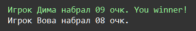
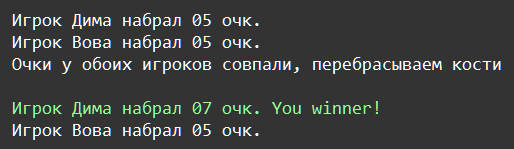

    Форматирование: Задание 5 100 баллов

Два игрока – Дима и Вова по очереди бросают игральные кости, состоящие из 2-х кубиков с цифрами от 1 до 6 на сторонах. Выигрывает тот, у кого сумма цифр на кубиках больше. Если совпадёт сумма цифр у обоих игроков, то они перебрасывают кости заново. В случае переброса, промежуточные результаты тоже выводите на печать.

Выводите имена игроков в отсортированном виде по количеству очков от большего к меньшем. Количество очков выводите с помощью форматирования, а строку с победителем выделите зелёным цветом. Напротив победителя написать You winner.

Если сумма чисел меньше 10, то с помощью форматирования, заполните нулём значение до 2-х знаков в выводе.

