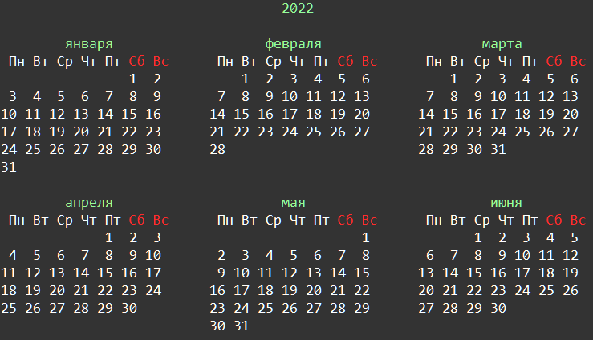

    Форматирование: Задание 6 140 баллов
С помощью модуля calendar запишите календарь текущего года в файл calendar.txt. После записи выведите из этого файла календарь с раскрашенным в зелёный цвет годом и месяцами. А субботу и воскресенье раскрасьте в красный цвет. Раскрашивание сделать с помощью модуля colorama и f-строк.

