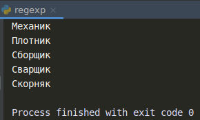

    Регулярные выражения: Задание 3 - 50 баллов
Используя регулярные выражения, выведите из файла job.txt все профессии имеющие длину 7 символов, и начинающиеся на от К до С и заканчивающиеся на к.

