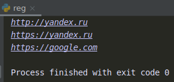

    Регулярные выражения: Задание 1 - 30 баллов
С помощью регулярных выражений выведите из этой строки все url без дубликатов. 

text = 'Сначала был адрес http://yandex.ru, потом стал https://yandex.ru. \ Гугл https://google.com имеет шире охват чем https://yandex.ru.'

