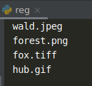

    Регулярные выражения: Задание 2 - 40 баллов
С помощью регулярных выражений выведите из многострочного текста все строки, имеющие расширения графических файлов.

text = '''Примеры расширений файлов: 
wald.jpeg 
wow.mp4 
book.txt 
forest.png 
fox.tiff 
wood.pdf 
hub.gif 
small.zip 
sound.mp3
'''

