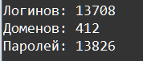

    Регулярные выражения: Задание 4 - 100 баллов
Используя одно регулярное выражение, получите из файла base.txt все уникальные логины, домены и пароли. Каждый список запишите в свой файл. Выведите на экран количество найденных объектов:

