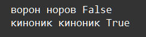

    Типы данных int, str: Задание 3 25 баллов
Проверьте, являются ли следующие строки и числа палиндромами:

"ворон", "киноник", "ротатор", "город", "тартрат", 721217, 123321

Выведите результат в следующем виде:

