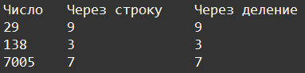

    Типы данных int, str: Задание 5 30 баллов
Даны числа:

var_1, var_2, var_3 = 29, 138, 7005

Получите последнюю цифру первого числа, вторую цифру второго числа и первую цифру третьего двумя способами:
1. Через приведение к строке
2. Используя математические операции

