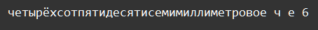

    Типы данных int, str: Задание 9 100 баллов
Даны четыре строки:

'четырёхсотпятидесятисемимиллиметровое'
'метоксихлордиэтиламинометилбутиламиноакридин'
'автомотовелофототелерадиомонтёр'
'автоэлектростеклоподъемники'

Получите сумму встречающихся в строке первого и последнего символа. Обращайтесь к нужным элементам строки по индексам.

