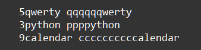

    Типы данных int, str: Задание 10 120 баллов
Даны следующие строки:

'5qwerty', '3python', '9calendar'

С помощью функции print(), преобразований строк и цифр внутри самих строк получите следующий вывод:

