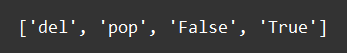

    Типы данных - list: Задание 1 20 баллов
Дан список строк:

main_list = ['True', 'False', 'pop', 'remove', 'del']

Выведите на экран следующий результат:

Есть несколько вариантов решения этого задания.