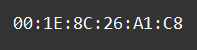

    Типы данных - list: Задание 6 80 баллов
Даны 2 списка:

digits = ['1', '2', '3', '4', '5', '6', '7', '8', '9', '0']

symbols = ['A', 'B', 'C', 'D', 'E', 'F', 'G']

Получите следующий результат:

