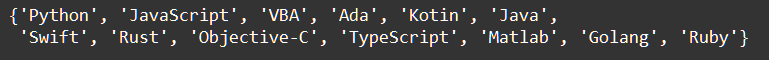

    Типы данных - tuple, dictionary, set, none: Задание 3* 30 баллов

Получите уникальные элементы из кортежа languages:

languages = ('Matlab', 'Objective-C', 'Python', 'Ada', 'Ruby',
'Golang', 'Ruby', 'Java', 'VBA', 'Python', 'TypeScript',
'Swift', 'Objective-C', 'Rust', 'VBA', 'Kotin', 'JavaScript')

