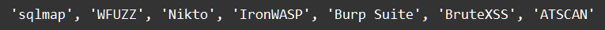

    Типы данных - tuple, dictionary, set, none: Задание 4* 50 баллов
Дан объект: 

new_set = {'sqlmap', 'IronWASP', 'Burp Suite', 'Nikto', 'ATSCAN',
'BruteXSS', 'WFUZZ'}

Вывести одной строкой кода следующий результат

Вам нужно получить в точности такой же вывод.