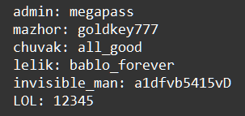

    Типы данных - tuple, dictionary, set, none: Задание 5* 70 баллов
Дан словарь:

access = {'admin': 'megapass', 'mazhor': 'goldkey777', 'chuvak': 'all_good',
'lelik': 'bablo_forever', 'invisible_man': 'a1dfvb5415vD',
'LOL': 12345}

Получите следующий результат, приведя исходный объект к другому типу, используя известные вам приёмы и методы.

