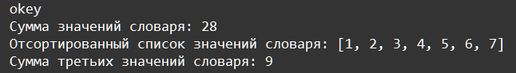

    Типы данных - tuple, dictionary, set, none: Задание 6 80 баллов
Дан словарь:

target_dict = {'o': 3, 'd': 7, 'k': 5, 'w': 2, 'e': 6, 'g': 1, 'y': 4}

Получите следующий результат, используя известные вам функции и методы

Для вывода каждой строки используйте свою функцию print().