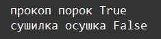
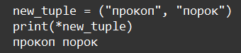

    Типы данных - tuple, dictionary, set, none: Задание 7 80 баллов
Дан словарь:

my_dict = {1: ("прокоп", "порок"), 2: ("сушилка", "осушка"),
3: ("вязанка", "навязка"), 4: ("каторга", "рогатка"),
5: ("плесень", "полдник")}

Проверьте, состоят ли элементы кортежа каждого значения из одних и тех же букв.

Для вывода содержимого кортежа, можно использовать распаковку

