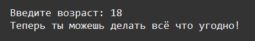

    Условные операторы: Задание 2 25 баллов
На вход программе подаётся число. Если число от 1 до 6, то вывести "Детство это – прекрасно!". Если число от 7 до 17, вывести "Учиться, учиться, учиться...". Если число от 18 до 64, вывести "Теперь ты можешь делать всё что угодно!", если число от 65 до 100, вывести "Заслуженный отдых". Во всех других случаях, вывести "Введите число от 1 до 100".

