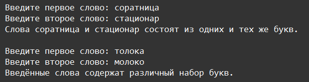

    Условные операторы: Задание 3 25 баллов
Измените решение задания 7 из урока Типы данных tuple, dictionary, set с использованием функции получения ввода пользователя, условия и моржового оператора.

