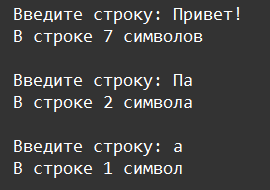

    Условные операторы: Задание 4 70 баллов
На вход в программу подаётся произвольная строка, длиной до 100 символов. Выведите количество символов в строке с правильным склонением. При вводе строки более 100 символов, вывести "Количество символов не должно быть больше 100!".
Условные

