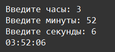

     Условные операторы: Задание 5 90 баллов
На вход в программу по очереди подаются 3 числа. Выведите время в формате 02:53:01
Если любое из чисел не попадает в диапазон формата времени, выведите "Введите числа для часов от 0 до 23, и для минут и секунд от 0 до 59".

Нельзя использовать форматирование или строковые методы.
Допускается использование не более четырёх условий if.