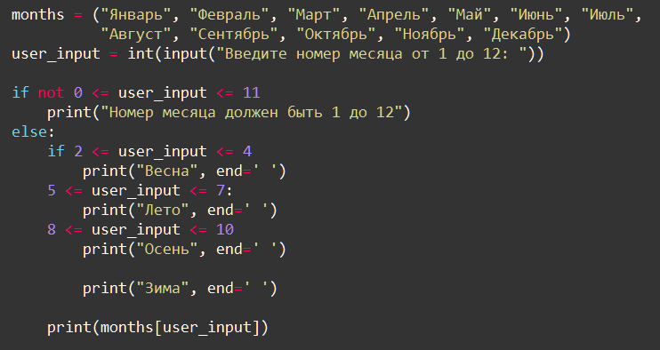
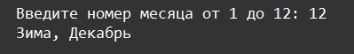
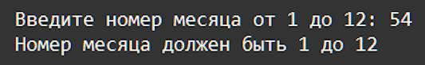

    Условные операторы: Задание 6 100 баллов
Вставьте пропущенные операторы, чтобы получить работающий код и исправьте ошибки синтаксиса и логики в коде.
Объедините строку запроса ввода и условия с помощью моржового оператора.

