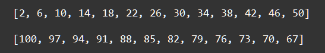
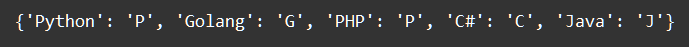

    Циклы: Задание 2 30 баллов
С помощью генератора списков выведите следующие списки:

С помощью генератора словаря и строки languages создайте следующий словарь:

languages = 'Python Golang PHP C# Java'

