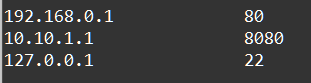

    Циклы: Задание 3 30 баллов
Используя кортежи

targets = ('192.168.0.1', '10.10.1.1', '127.0.0.1')

ports = (80, 8080, 22)

двумя различными способами, используя цикл for выведите следующие пары

