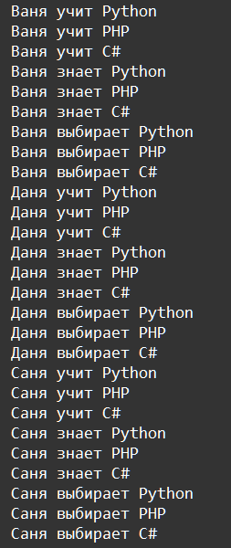

    Циклы: Задание 4 40 баллов
Даны 3 кортежа

names = ('Ваня', 'Даня', 'Саня')

actions = ('учит', 'знает', 'выбирает')

languages = ('Python', 'PHP', 'C#')

С помощью циклов вывести следующую последовательность, уложившись в 4 строки кода без учёта строк задания.

