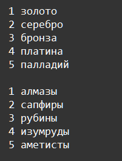

    Циклы: Задание 5 80 баллов
Дан кортеж:

jewels = ('золото', 'алмазы', 'серебро', 'сапфиры', 'бронза',
'рубины', 'платина', 'изумруды', 'палладий', 'аметисты')

Отделите с помощью циклов металлы от драгоценных камней и, используя соответствующую функцию, проставьте порядковые номера.

