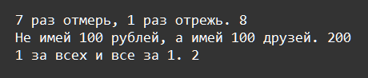

    Циклы: Задание 8 120 баллов
Создайте кортеж из строки с поговороками, получите сумму чисел из каждой строки.

targets = "7 раз отмерь, 1 раз отрежь.;Не имей 100 рублей, а имей 100 друзей.;1 за всех и все за 1."

