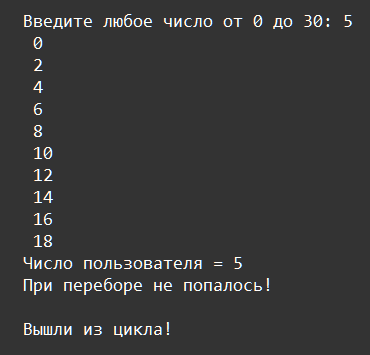
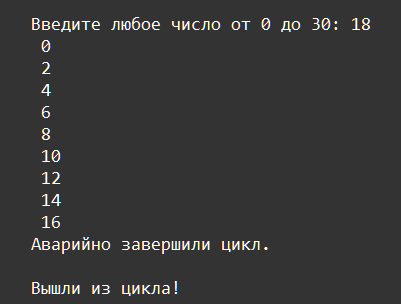

    Циклы: Задание 11 200 баллов
Создайте цикл, который будет печатать чётные цифры от 0 до 20 не включительно. Добавьте перед печатью цикла запрос ввода пользователя – если введённое число попадётся среди перебираемых, прерываем цикл и печатаем сообщение. Если, не попадётся, сообщаем об этом пользователю

  
