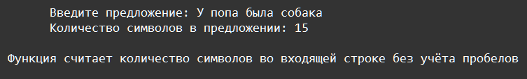

    Функции: Задание 1 20 баллов
Напишите функцию, подсчитывающую количество знаков текста без учёта пробелов в предложении, которое подаётся на вход в программу. Добавьте и выведите строку документации: Функция считает количество символов во входящей строке без учёта пробелов.

