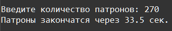
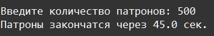
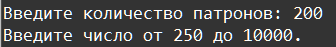

    Функции: Задание 2 20 баллов
Используя функции и аргументы, напишите следующую программу:

На вход в программу подаётся число от 250 до 10000. Число означает количество патронов.

Скорострельность пулемёта 1200 выстрелов в минуту. В одной пулемётной ленте 250 патронов. На смену ленты уходит 20 секунд.

За сколько секунд пулемётчик расстреляет все патроны, если считать, что первая лента уже установлена в пулемёт?

Если число на входе не попадает в диапазон, вывести: Введите число от 250 до 10000.

