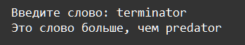

    Функции: Задание 3 30 баллов
На вход в программу подаётся произвольное слово. С помощью функции lambda сравните это слово со словом predator, и если слово будет больше, то вывести 'Это слово больше, чем predator' иначе 'Это слово меньше, чем predator'

