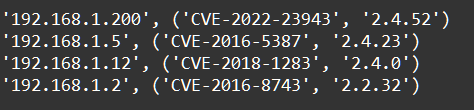

    Функции: Задание 4 50 баллов
Используя lambda функцию, отсортируйте словарь results по убыванию уязвимой версии, выведите результат как на скриншоте.

results = { '192.168.1.2': ('CVE-2016-8743', '2.2.32'),
'192.168.1.12': ('CVE-2018-1283', '2.4.0'),
'192.168.1.200': ('CVE-2022-23943', '2.4.52'),
'192.168.1.5': ('CVE-2016-5387', '2.4.23')}

Решение нужно выполнить в одной строке