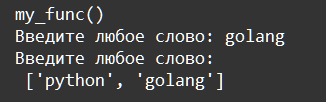
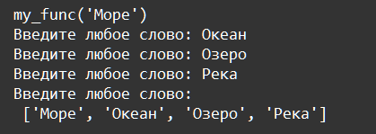
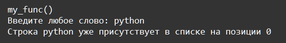

    Функции: Задание 5 50 баллов
Напишите функцию,

• принимающую один аргумент, по умолчанию равный строке ‘python’

• в теле которой, присутствует конструкция, запрашивающая неограниченное количество слов

• после ввода пустой строки (нажатие ENTER без ввода) распечатывается список слов

• если введённая строка уже есть в списке, завершить ввод и вывести сообщение Строка * уже присутствует в списке на позиции *

