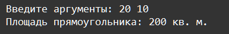

    Функции: Задание 6 80 баллов
Напишите функцию, которая принимает произвольное количество позиционных аргументов в виде натуральных целых чисел через пробел.

Если это будет одно число, то вычислить площадь круга (число будет диаметром круга) и вывести Площадь круга: * кв. м.

Если будут введены 2 числа, то высчитать площадь прямоугольника и вывести Площадь прямоугольника: * кв. м.

Если 3 числа, высчитать площадь треугольника и вывести Площадь треугольника: * кв. м. При условии, что сумма введённых чисел равна периметру равностороннего треугольника.

Ввод данных должен находиться в вызове функции.