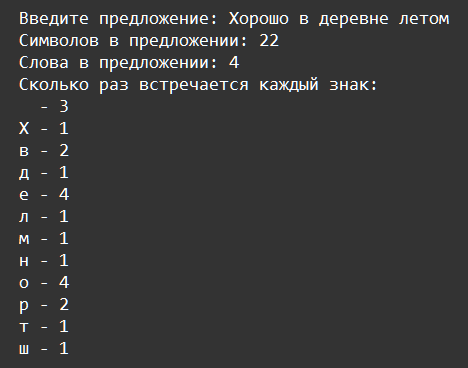

    Функции: Задание 7 150 баллов
Напишите программу, состоящую из следующих функций:

Вызов первой функции находится в точке входа. Она запрашивает у пользователя предложение.

Вторая считает количество символов с пробелами,

Третья - количество слов,

Четвёртая - сколько раз встречается каждый символ.

Подсчёт каждого символа выведите в отсортированном виде по алфавиту.

