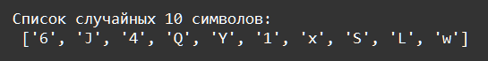

    Модули и пакеты: Задание 1 30 баллов
Модули и пакеты: Задание 1 30 баллов
С помощью модуля string, составьте список, состоящий из
символов верхнего и нижнего регистра английского алфавита
и цифр. С помощью модуля random выберите 10 случайных
символов из этого списка и выведите их на экран.

В модуле random есть три разных метода, позволяющих решить эту задачу. Постарайтесь найти все.