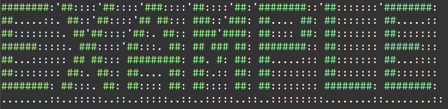

    Модули и пакеты: Задание 2 50 баллов
Раскрасьте картинку с помощью модуля colorama. Строку импортируйте из файла example.py

Есть 2 варианта решения, попробуйте реализовать оба.
Используйте цвета из поля Fore.