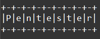
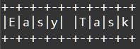

    Модули и пакеты: Задание 3 100 баллов
1. Сделайте надпись как на картинке с помощью модуля pyfiglet.
 
2. Создайте свой модуль с одной функцией, получающей один аргумент и возвращающий строку в нужном оформлении.

    Оформление строки нужно реализовать самостоятельно, использовать модуль
     pyfiglet в вашем модуле нельзя.
     Ваш модуль должен не печатать строку, а только возвращать её по аналогии с 
     вызовом pyfiglet