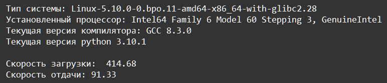

    Модули и пакеты: Задание 4 100 баллов
С помощью модулей platform и speedtest-cli соберите информацию о системе и распечатайте её на экране. Обратите внимание, скорость возвращается в битах, вам нужно привести это число к мегабайтам

