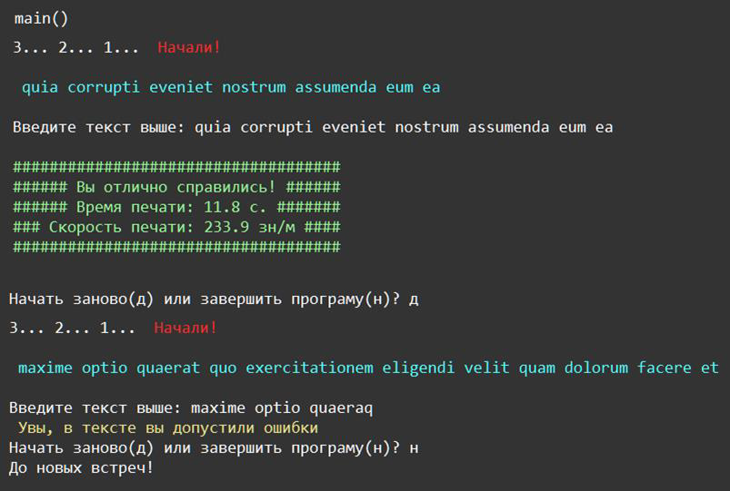

    Модули и пакеты: Задание 5 220 баллов
Напишите тренажёр слепой печати. Для генерации случайной строки, используйте пакет lorem-text. Подробнее про Lorem Ipsum можете прочитать тут.

Создайте обратный отсчёт "3... 2... 1... Начали!" с паузой в 1 секунду между цифрами, после которого на экране появится строка со случайным количеством слов - от 5 до 15.

Задача пользователя напечатать без ошибок выведенную на экран строку. Ввод заканчивается нажатием Enter.

Если строка напечатана без ошибок, пользователь видит сообщение со статистикой: затраченным временем и скоростью печати.

Если же в строке были допущены опечатки, печатаем сообщение об ошибке.

Далее предлагаем пользователю начать заново или завершить программу.

<b>Произведите декомпозицию задачи - создайте свои функции для отсчета времени, для работы с вводом пользователя, для подсчёта и отображения статистики и для основного кода программы.</b>

Использовать можно не более 4х импортированных пакетов

<b>Постарайтесь, как можно точнее повторить оформление вашей программы по примеру скриншота со следующей страницы.</b>

