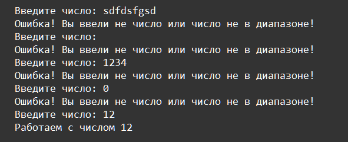

    Исключения: Задание 1 30 баллов
Напишите функцию, которая в цикле запрашивает ввод пользователя, ожидая от него число от 10 до 20 включительно. Максимальная длина кода тела функции 4 строки:

В этом задании используем только цикл, исключения не нужны