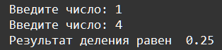
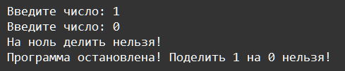
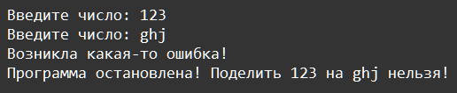

    Исключения: Задание 2 20 баллов
Доработайте пример из второго видео, добавив проверку результата работы функции user_input_division(), вызываемой в точке входа. Если результат деления привёл к ошибке, мы должны увидеть сообщение об ошибке и завершить выполнение сообщением Программа остановлена.

Если же результатом выполнения функции стало число, выведите сообщение Результат деления равен <ответ>

