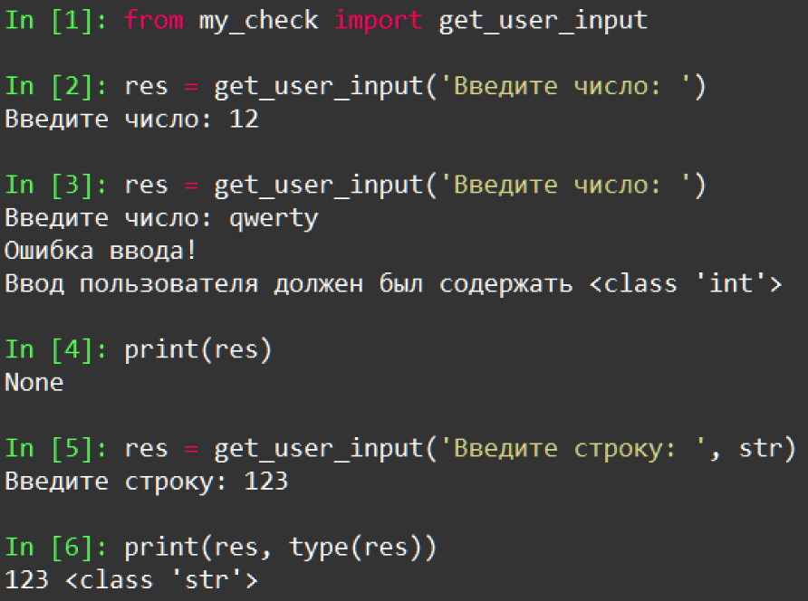

    Исключения: Задание 3 25 баллов
Создайте собственный модуль обработки исключений ввода пользователя. Функция в модуле получает 2 аргумента: строку приглашения и тип данных, к которому нужно привести полученный объект. Возвращаемое значение должно соответствовать указанному типу. Используйте аргументы по умолчанию.
В следующих заданиях используйте именно этот модуль для получения ввода и его проверки. Пример использования:

