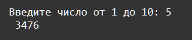

    Исключения: Задание 4 25 баллов
На вход в программу подаётся одно число от 1 до 10. Если введённое число будет вне диапазона, то вывести Введите число от 1 до 10. Модуль random возвращает ещё одно случайное число от 10 до 100.

Посчитать сумму всех чисел в диапазоне между этими двумя числами, включая сами эти числа.

Например, если будут числа 8 и 12, то результат получится 50, то есть 8+9+10+11+12.

