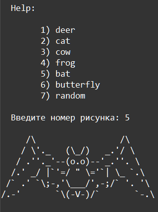

    Исключения: Задание 5 30 баллов
Импортируйте из файла в приложении модуль animals.py (в модуле ничего менять НЕ нужно).

При запуске программы выведите такое же меню, как на скриншоте.

Запросите ввод пользователя, который соответствует номеру рисунка. Если выбран номер 7, то рисунок выбирается случайно.

Если введено число вне диапазона, выведите Введите число от 1 до 7.

Используйте словарь для хранения номеров, названий и ссылок на картинку. В ключи уберите нумерацию, а в значения положите названия животных и ссылку на их картинку. Используя этот словарь, отобразите меню, а потом получайте из него картинки по вводу пользователя.

